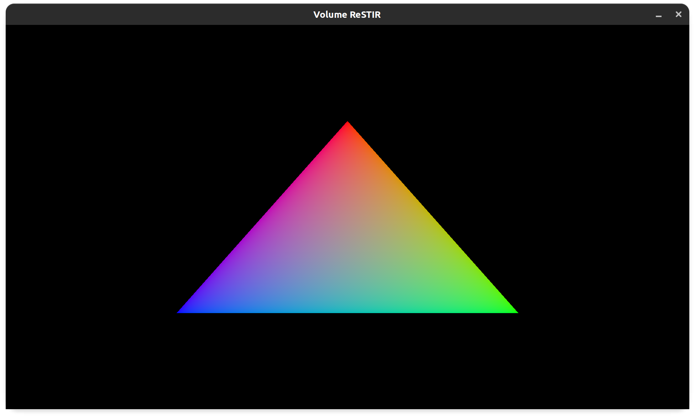

# Volume-ReSTIR
Vulkan implementation of Fast Volume Rendering with Spatiotemporal Reservoir Resampling.

- [Project Pitch](https://github.com/TheSmokeyGuys/Volume-ReSTIR-Vulkan/blob/main/docs/CIS%20565%20Final%20project%20pitch.pdf)
- [Milestone 1 Presentation](https://github.com/TheSmokeyGuys/Volume-ReSTIR-Vulkan/blob/UserRYang-patch-1/docs/CIS%20565%20Milestone1.pdf)

## Milestone 1 (11/17/2021)
By milestone 1, we have set up a basic Vulkan rendering pipeline using [vk-bootstrap](https://github.com/charles-lunarg/vk-bootstrap).

## References
1. Daqi Lin, Chris Wyman, Cem Yuksel. [Fast Volume Rendering with Spatiotemporal Reservoir Resampling](https://research.nvidia.com/publication/2021-11_Fast-Volume-Rendering). ACM Transactions on Graphics (Proceedings of SIGGRAPH Asia 2021), 40, 6, 2021.
2. [OpenVDB](https://www.openvdb.org/) for VDB data loading.
3. [vk-bootstrap](https://github.com/charles-lunarg/vk-bootstrap).
4. [spdlog](https://github.com/gabime/spdlog) for fast C++ logging.
5. Common graphics utilities [glfw](https://github.com/glfw/glfw), [glm](https://github.com/g-truc/glm), [stb](https://github.com/nothings/stb).
